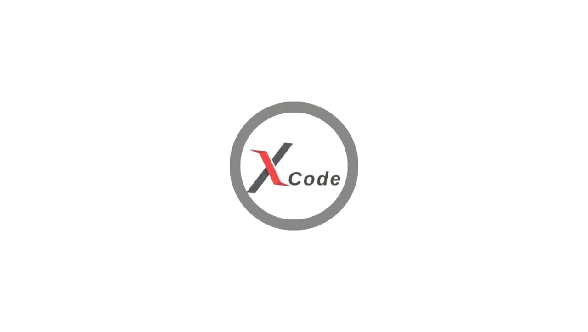

# 🚀 X CODE - Company Landing Page

<div align="center">



**موقع شركة X CODE - صفحة هبوط احترافية متعددة اللغات**

[](https://developer.mozilla.org/en-US/docs/Web/HTML)
[](https://developer.mozilla.org/en-US/docs/Web/CSS)
[](https://developer.mozilla.org/en-US/docs/Web/JavaScript)
[](https://tailwindcss.com/)

[🌐 Live Demo](https://xcode-company.netlify.app) • [📖 Documentation](#documentation) • [🚀 Getting Started](#getting-started)

</div>

---

## 📋 Table of Contents

- [✨ Features](#-features)
- [🎨 Design](#-design)
- [🛠️ Technologies](#️-technologies)
- [🚀 Getting Started](#-getting-started)
- [📁 Project Structure](#-project-structure)
- [🎯 Sections](#-sections)
- [🌍 Internationalization](#-internationalization)
- [📱 Responsive Design](#-responsive-design)
- [🎨 Customization](#-customization)
- [📦 Dependencies](#-dependencies)
- [🤝 Contributing](#-contributing)
- [📄 License](#-license)
- [👥 Team](#-team)

---

## ✨ Features

### 🌟 Core Features
- **🌍 Multi-language Support**: Arabic & English with RTL/LTR support
- **📱 Fully Responsive**: Optimized for all devices (Mobile, Tablet, Desktop)
- **🌙 Dark/Light Mode**: Toggle between themes
- **⚡ Fast Performance**: Optimized loading and smooth animations
- **🎯 SEO Optimized**: Meta tags, structured data, and semantic HTML

### 🎨 Design Features
- **Modern UI/UX**: Clean, professional design
- **Smooth Animations**: CSS transitions and hover effects
- **Interactive Elements**: Engaging user interactions
- **Professional Typography**: Optimized font hierarchy
- **Color Consistency**: Cohesive color scheme throughout

### 🔧 Technical Features
- **Tailwind CSS**: Utility-first CSS framework
- **Vanilla JavaScript**: No heavy frameworks
- **GLightbox**: Image and video popups
- **Swiper.js**: Touch slider for testimonials
- **Local Storage**: User preferences persistence

---

## 🎨 Design

### Color Palette
- **Primary**: `#3d63dd` (Blue)
- **Secondary**: `#f3f4f6` (Light Gray)
- **Accent**: `#10b981` (Green)
- **Text**: `#1f2937` (Dark Gray)
- **Background**: `#ffffff` (White)

### Typography
- **Primary Font**: Poppins (Google Fonts)
- **Weights**: Light, Regular, Medium, SemiBold, Bold
- **Responsive**: Scales appropriately across devices

---

## 🛠️ Technologies

### Frontend
- **HTML5**: Semantic markup
- **CSS3**: Modern styling with Tailwind CSS
- **JavaScript (ES6+)**: Interactive functionality
- **Tailwind CSS**: Utility-first CSS framework

### Libraries & Tools
- **GLightbox**: Lightbox for images and videos
- **Swiper.js**: Touch slider component
- **Lineicons**: Icon library
- **Vite**: Build tool and dev server

### Development Tools
- **VS Code**: Recommended editor
- **Live Server**: Local development
- **Git**: Version control

---

## 🚀 Getting Started

### Prerequisites
- Node.js (v14 or higher)
- npm or yarn package manager
- Modern web browser

### Installation

1. **Clone the repository**
   ```bash
   git clone https://github.com/your-username/xcode-landing-page.git
   cd xcode-landing-page
   ```

2. **Install dependencies**
   ```bash
   npm install
   ```

3. **Start development server**
   ```bash
   npm run dev
   ```

4. **Build for production**
   ```bash
   npm run tw-build
   ```

### Quick Start
```bash
# Clone and setup
git clone https://github.com/your-username/xcode-landing-page.git
cd xcode-landing-page
npm install
npm run dev

# Open in browser
open http://localhost:3000
```

---

## 📁 Project Structure

```
xcode-landing-page/
├── 📁 assets/
│   ├── 📁 css/
│   │   ├── main.css          # Compiled Tailwind CSS
│   │   └── languages.css     # RTL/LTR styles
│   ├── 📁 js/
│   │   ├── main.js           # Main JavaScript
│   │   └── languages.js      # Language switching
│   ├── 📁 img/               # Images and photos
│   ├── 📁 font/              # Custom fonts
│   └── 📁 favicon/           # Site icons
├── 📁 src/
│   └── 📁 css/
│       └── tailwind.css      # Tailwind source
├── 📄 index.html             # Main HTML file
├── 📄 tailwind.config.js     # Tailwind configuration
├── 📄 package.json           # Dependencies
└── 📄 README.md              # This file
```

---

## 🎯 Sections

### 1. **Hero Section**
- Compelling headline and call-to-action
- Background animations
- Language toggle integration

### 2. **About Section**
- Company overview
- Mission and vision
- Professional imagery

### 3. **Services Section**
- Service offerings with icons
- Detailed descriptions
- Interactive hover effects

### 4. **Portfolio Section**
- Project showcase
- Filterable categories
- Image lightbox integration

### 5. **Team Section**
- Team member profiles
- Social media links
- Professional photos

### 6. **FAQ Section**
- Common questions
- Expandable answers
- Search functionality

### 7. **Contact Section**
- Contact information
- Contact form
- Social media links

### 8. **Footer**
- Company information
- Quick links
- Social media icons

---

## 🌍 Internationalization

### Supported Languages
- **العربية (Arabic)**: RTL layout
- **English**: LTR layout

### Features
- **Automatic Direction**: RTL/LTR based on language
- **Text Translation**: Complete content translation
- **Font Optimization**: Appropriate fonts for each language
- **Layout Adaptation**: Proper alignment and spacing

### Language Switching
```javascript
// Toggle between languages
function toggleLanguage() {
  const currentLang = document.documentElement.lang;
  const newLang = currentLang === 'ar' ? 'en' : 'ar';
  
  document.documentElement.lang = newLang;
  document.documentElement.dir = newLang === 'ar' ? 'rtl' : 'ltr';
  
  applyTranslations(newLang);
}
```

---

## 📱 Responsive Design

### Breakpoints
- **Mobile**: `< 640px`
- **Tablet**: `640px - 1023px`
- **Desktop**: `≥ 1024px`

### Features
- **Mobile-First**: Designed for mobile devices first
- **Flexible Grid**: Responsive grid system
- **Touch-Friendly**: Optimized for touch interactions
- **Performance**: Optimized images and assets

### Navigation
- **Desktop**: Horizontal navigation
- **Mobile**: Hamburger menu
- **Language Toggle**: Accessible on all devices

---

## 🎨 Customization

### Colors
Edit `tailwind.config.js` to customize colors:
```javascript
module.exports = {
  theme: {
    extend: {
      colors: {
        primary: '#3d63dd',
        secondary: '#f3f4f6',
        // Add your custom colors
      }
    }
  }
}
```

### Content
- **Text**: Edit `assets/js/languages.js` for translations
- **Images**: Replace images in `assets/img/`
- **Icons**: Use Lineicons or custom SVG icons

### Styling
- **CSS**: Modify `assets/css/languages.css` for custom styles
- **Tailwind**: Use utility classes or extend configuration

---

## 📦 Dependencies

### Production Dependencies
```json
{
  "glightbox": "^3.2.0",
  "swiper": "^11.0.0"
}
```

### Development Dependencies
```json
{
  "tailwindcss": "^3.4.10",
  "vite": "^6.3.4"
}
```

### CDN Resources
- **Lineicons**: Icon library
- **Google Fonts**: Typography
- **Swiper CSS**: Slider styles

---

## 🤝 Contributing

We welcome contributions! Please follow these steps:

1. **Fork the repository**
2. **Create a feature branch**
   ```bash
   git checkout -b feature/amazing-feature
   ```
3. **Commit your changes**
   ```bash
   git commit -m 'Add amazing feature'
   ```
4. **Push to the branch**
   ```bash
   git push origin feature/amazing-feature
   ```
5. **Open a Pull Request**

### Development Guidelines
- Follow existing code style
- Test on multiple devices
- Ensure accessibility standards
- Update documentation

---

## 📄 License

This project is licensed under the MIT License - see the [LICENSE](LICENSE) file for details.

```
MIT License

Copyright (c) 2024 X CODE

Permission is hereby granted, free of charge, to any person obtaining a copy
of this software and associated documentation files (the "Software"), to deal
in the Software without restriction, including without limitation the rights
to use, copy, modify, merge, publish, distribute, sublicense, and/or sell
copies of the Software, and to permit persons to whom the Software is
furnished to do so, subject to the following conditions:

The above copyright notice and this permission notice shall be included in all
copies or substantial portions of the Software.
```

---

## 👥 Team

### Development Team
- **Abdelrahman Amer** - Mobile App Developer
- **Mohamed Emad** - Web App Developer  
- **Abdullah Mahmoud** - UI/UX Designer

### Contact Information
- **Email**: info@xcode.com
- **Phone**: +20 114 763 1941
- **Address**: Beni Suef, Tazmant Al-Sharqiya, Egypt

### Social Media
- **Facebook**: [X CODE](https://facebook.com/xcode)
- **LinkedIn**: [X CODE](https://linkedin.com/company/xcode)
- **WhatsApp**: [+20 114 763 1941](https://wa.me/201147631941)

---

## 🚀 Deployment

### Netlify (Recommended)
1. Connect your GitHub repository
2. Set build command: `npm run tw-build`
3. Set publish directory: `.`
4. Deploy!

### Vercel
1. Import your repository
2. Set framework preset to "Other"
3. Deploy automatically

### Manual Deployment
1. Build the project: `npm run tw-build`
2. Upload files to your web server
3. Configure your domain

---

<div align="center">

**Made with ❤️ by X CODE Team**

[🌐 Visit Website](https://xcode-company.netlify.app) • [📧 Contact Us](mailto:info@xcode.com)

</div>
